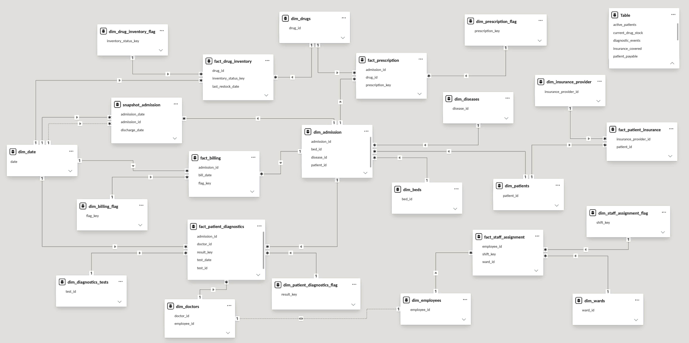

# Hospital HMIS Dimensional Data Modeling Project

## Project Summary

Designed and implemented a Kimball dimensional data model for a Hospital Management Information System using Power BI, Power Query and DAX to support admissions, clinical, financial, insurance, pharmacy and staff analytics.

## Overview

This project transforms 19 raw HMIS source tables into a hybrid dimensional model designed around business processes and analytical grain.

The workflow covered data profiling, Power Query transformation, dimensional modeling, DAX measures, dashboard development, and independent validation against the original source data.

## Why This Project?

- A beautiful dashboard can still tell the wrong story if the data model behind it is poorly designed.
- Incorrect relationships and wrong table grain can lead to double counting and incorrect KPIs.
- Poor filter behaviour can produce inconsistent or misleading business insights.
- This project was built to go beyond dashboard creation and focus on the data model powering the BI solution.
- The goal was to build a structured dimensional model that makes Business Intelligence more accurate, consistent, and trustworthy.

## Project Workflow


## Problem Statement

The source HMIS data was organized as normalized operational tables. The objective was to transform it into a reliable analytical model that enables cross-functional hospital reporting while avoiding incorrect relationships, double counting and ambiguous analytical paths.

## Dataset

- **Source:** https://www.kaggle.com/datasets/shalakagangurde/hospital-hmis-dataset-for-healthcare-analytics?resource=download
- 19 synthetic but realistic HMIS CSV tables
- Data period: 2020–2025
- Key areas: Patients, Admissions, Billing, Diagnostics, Prescriptions, Insurance, Drugs, Inventory, Employees and Staff Assignments
- 30,000 patients
- 45,000 admissions
- 73,109 prescriptions
- 63,269 diagnostic events

The original dataset is provided under the **MIT License**.

> **Note:** This project uses a synthetic HMIS dataset and is intended for demonstration and portfolio purposes only. It does not represent real hospital or patient data.

## Tools & Technologies

- Power BI
- Power Query
- DAX
- Excel
- Kimball Dimensional Modeling

## Project Highlights

### Data Preparation - Profiling & ELT

- Profiled and classified 19 source tables by grain and business role.
- Extracted & loaded source csv files into Power BI's Power Query.
- Organized source and analytical Power Query layers (source files referenced in analytical layer). 
- Performed data quality checks & cleaning in analytical layer.
- Applied transformations required on analytical layer for dimensional modeling.

### Dimensional Modeling

- Designed a grain-first hybrid dimensional model.
- Created conformed dimensions.
- Used selective snowflaking where justified.
- Avoided fact-to-fact relationships.
- Created an accumulating admission snapshot.
- Implemented process-specific flag dimensions.
- Created standard DAX measures.

### Validation

- Independently calculated expected results from the original CSV files using Excel.
- Compared expected results with corresponding Power BI measures and visual outputs.
- Validated key KPIs, filters, relationships, grain and double-counting.
- Tested cross-fact isolation and admission snapshot calculations.

### Data Model Usage Guide

- A detailed Data Model Usage Guide is prepared for analysts & relevant stakeholders.


## Final Data Model



The Power BI model supports analysis across admissions, clinical activity, billing, insurance, pharmacy and staff operations.


## How to Run / Explore

1. Clone or download the repository.
2. Open `power_bi/hospital_hmis_dimensional_model.pbix` in Power BI Desktop.
3. Update the source file path in the downloaded PBIX file to the location of the repository's `data/raw/` folder.
4. Refresh the model.
5. Review the model relationships, standard DAX measures and report pages.
6. Refer to the project report for the complete modeling decisions and validation process.

> **Important:** The PBIX file cannot automatically know where the repository was downloaded on your computer. You must update the **file path** in the downloaded PBIX file before refreshing the model.

### Repository Structure

```text
data/
└── raw/                  # Source HMIS CSV files

power_bi/
└── hospital_hmis_dimensional_model.pbix

images/                   # Model and validation screenshots

workflow/
└── workflow.png

docs/
└── hmis_dimensional_modeling_report.pdf
└── hmis_data_model_usage_guide.pdf

dax/
└── standard_measures.md

.gitignore

README.md
```

## Results & Conclusion

The final model provides a structured analytical layer for hospital management reporting while preserving business-process grain and minimizing double-counting and relationship ambiguity.

Key analytical areas include admissions, length of stay, billing, insurance coverage, diagnostics, prescriptions, inventory and staff assignments.

## Future Work

Future improvements could extend the model for deeper historical and operational analysis:

- **Bed occupancy:** Add historical occupancy data for utilization analysis.
- **Inventory history:** Capture stock receipts, issues and adjustments.
- **Staff history:** Add assignment dates and staffing changes.
- **Insurance linkage:** Strengthen policy, admission and billing/claim relationships.
- **Prescription dates:** Enable time-based medication analysis.
- **Charge-level billing:** Reintroduce billing details with reliable reconciliation rules.
- **SCD:** Add Slowly Changing Dimensions when historical attribute tracking is required.
- **Row Level Securtiy (RLS):** Add RLS if required.

## Limitations

- Dataset is synthetic.
- Inventory represents current state rather than historical movements.
- Staff assignments have no historical dates.
- Prescription records lack a prescription date.
- Billing-detail values were not reconciled with billing totals and were therefore excluded from the analytical model.
- Some source dates extend into January 2026 despite the stated 2020–2025 dataset period.

## Detailed Documentation

- **Power BI Model:** `power_bi/hospital_hmis_dimensional_model.pbix`
- **DAX Measures:** `dax/standard_measures.md`
- **Project Report:** `docs/hmis_dimensional_modeling_report.pdf`
- **Data Model Usage Guide:** `docs/hmis_data_model_usage_guide.pdf`

## Author & Contact

**Rahuldev Veludandi**

- GitHub: [veludandi-rahuldev](https://github.com/veludandi-rahuldev)
- LinkedIn: [rahuldev-v](https://www.linkedin.com/in/rahuldev-v)
- Email: veludandirahul@gmail.com

